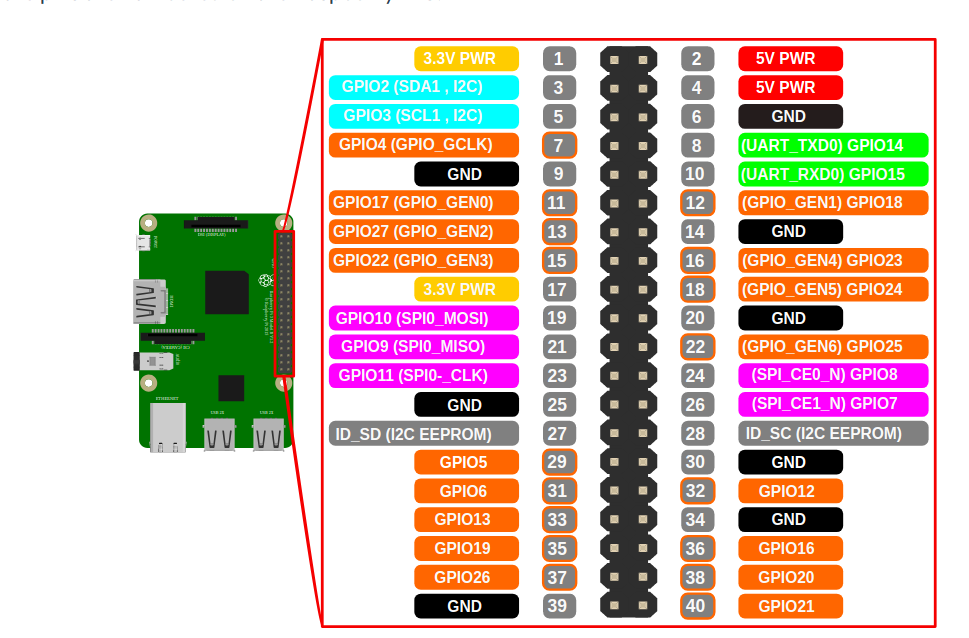

Recently useful URL (for me):

* [ECE590 Storage course page](http://people.duke.edu/~tkb13/courses/ece590-stor/)
* [ECE551 Programming, Data Structures, and Algorithms in C++](http://adhilton.pratt.duke.edu/ece-551)

Raspberry Pi 3:

* [Bare Metal Tutorial](https://github.com/bztsrc/raspi3-tutorial)
* [Pi OS](https://github.com/s-matyukevich/raspberry-pi-os)
* [Bare Metal Forum](https://www.raspberrypi.org/forums/viewforum.php?f=72)
* [CS 140e](https://cs140e.sergio.bz)
* [datasheet](https://web.stanford.edu/class/cs140e/docs/BCM2837-ARM-Peripherals.pdf)
* [answers](https://github.com/jwmcglynn/cs140e)

EAD

* [website](https://egov.uscis.gov/casestatus/landing.do)
* YSC1990042746
* [progress](http://www.checkuscis.com/en)

