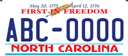

# 美国小记2

最近干了一件大事，买车。

待在美国农村里，没有车的日子是非常痛苦的。每逢周六，我和老婆早上坐公交车出门买菜，下午三点过才能回家。由于我们一次必须买一周的菜，手提根本提不动，所以还得带着行李箱出门。在中国，有人推着行李箱逛菜市场么？:) 而每周浪费一天还只是满足了基本的生存需求。至于出去玩耍的事情，我们想都不敢想。另外，由于我过段时间很可能要出去实习，而公司离我住的地方有20分钟的车程，如果没有车，这实习就黄了。

总之，我们就打算买车了。来美国之前，我对车是一窍不通。在恶补了几天知识后，我们前两天就跑去车行看车了。接待我们的是一个印度人，我看上了一辆卡罗拉，觉得车况还不错，虽然是绿的。于是，我就让他带我们去试驾。印度人问我会开吗，我说我开过我爸的车。我以为他会不让我开，结果他居然说等他把车开到一个安全的地方，就让我开。

由于很久没动过车了，我之前学的那一点皮毛也忘得差不多了，一上车就有点懵，开得过程中有好几次都忘了打转弯灯。有一次我错过了一个弯，我没有注意到我后面有车，一脚刹车就停下来了，吓得后面的车狂按喇叭。但是我旁边又是双黄线，后面的车又不敢超我（美国人还是挺守规矩的） ，只得等我慢悠悠的重新起步。还有一次更逗，我右转的时候居然跑到左边的道去了，吓得那个印度人赶紧来夺我的方向盘。后来他受不了，就不停的给我普及交通知识，还给我演示各种弯怎么转。总之，那个印度人就用那辆绿色的卡罗拉免费教了我一上午开车。:)

我觉得他人挺好的，但是我最后没有在他那里买车， 因为他一毛钱也不愿意降价，而且真的不太喜欢绿色的车。

结果刚走出车行的门，就看到朋友转发的一条卖车的消息，是一个来杜克交流一年的老师，因为要回国了，所以要卖掉她刚买了一年的新车，而且是辆白色的卡罗拉！（想着那个绿色就心里堵得慌）这个老师是个医生，同时也是个军人。她把车爱护的特别好，人给我们的感觉也很亲切。总之，聊了5分钟，我们的交易就成交了。

昨天去银行交易了车，然后去车管所上拍照，那个上牌照的工作人员叫我选一句话，那时我才知道美国的车牌上面居然还有印一句座右铭一样的话，他们也是挺逗的。于是我就选了First in freedom作为我车牌上的“座右铭”了。总之，共计耗时半小时，我们的车就到手啦。

车牌大概长这样：

